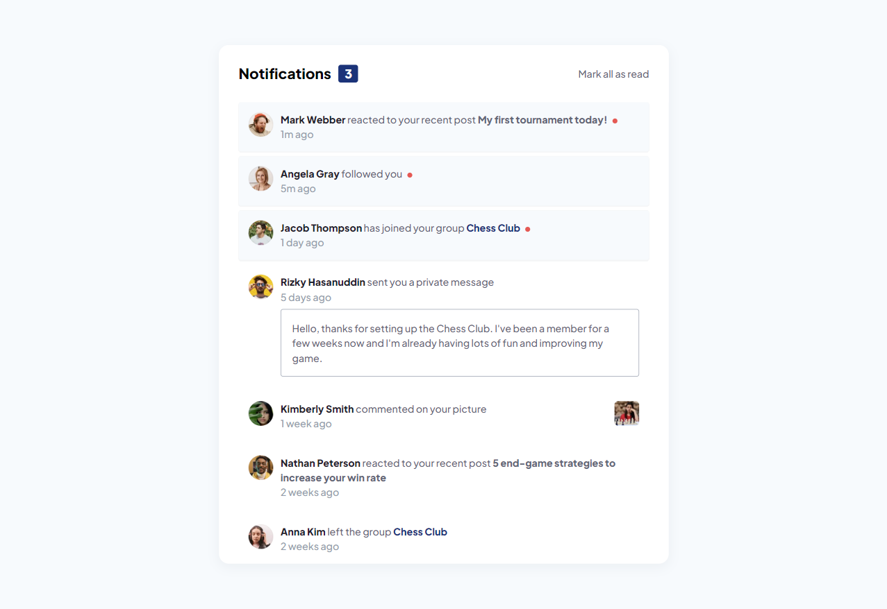

# Frontend Mentor - Notifications page solution

This is a solution to the [Notifications page challenge on Frontend Mentor](https://www.frontendmentor.io/challenges/notifications-page-DqK5QAmKbC). Frontend Mentor challenges help you improve your coding skills by building realistic projects. 

## Table of contents

- [Overview](#overview)
  - [The challenge](#the-challenge)
  - [Screenshot](#screenshot)
- [My process](#my-process)
  - [Built with](#built-with)
  - [What I learned](#what-i-learned)
  - [Continued development](#continued-development)
- [Author](#author)

## Overview

### The challenge

Users should be able to:

- Distinguish between "unread" and "read" notifications
- Select "Mark all as read" to toggle the visual state of the unread notifications and set the number of unread messages to zero
- View the optimal layout for the interface depending on their device's screen size
- See hover and focus states for all interactive elements on the page

### Screenshot

## My process

### Built with

- Semantic HTML5 markup
- CSS custom properties
- Sass
- Flexbox
- CSS Grid
- Mobile-first workflow

### What I learned

This was my first time building a page focusing on utility classes. It really helped the process of writing and applying CSS feel more organized and manageable. It was also my first time using Sass for a Frontend Mentor project, which also helped everything to feel a bit more tidy. I'm not sure, however, where utility classes are best used and if a page like this would be better suited to focusing on styling blocks. Because all the notifications use the same basic block, it felt odd giving each li a handful of utility classes instead of just calling them all `.notif` and styling that directly. Like I said, the whole process of writing CSS in general felt a lot more controlable using utility classes, so I will definitely continue to use them where they are appropriate going forward.

### Continued development

Moving forward I want to learn to use tailwind to generate utility classes, as it seems like a good development tool!

## Author

- Frontend Mentor - [@KeganF](https://www.frontendmentor.io/profile/KeganF)

